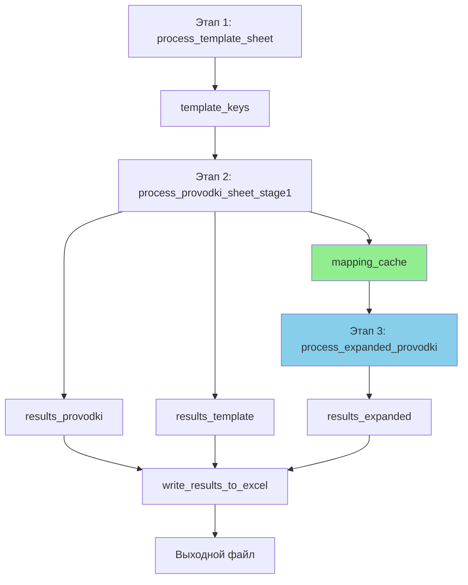

# План исправления функции process_expanded_provodki

## Проблема

На **этапе 3** в функции `process_expanded_provodki()` скрипт пытается прочитать ссылки из столбцов "Дт Мэпинг Робот" и "Кт Мэпинг Робот" напрямую из `wb_read`:

```python
# Строки 567-568 в new.py
dt_mapping_val = ws.cell(row=ref_row, column=col_dt_mapping).value
kt_mapping_val = ws.cell(row=ref_row, column=col_kt_mapping).value
```

**Проблема:** Этих ссылок в `wb_read` еще нет! Они формируются на **этапе 2** и записываются в файл только в конце выполнения скрипта в функции `write_results_to_excel()`.

## Текущий поток данных

### Этап 2: `process_provodki_sheet_stage1()`
1. Обрабатывает строки проводок без развёрнутых
2. Формирует ссылки на шаблон
3. Сохраняет результаты в `results_provodki` для последующей записи
4. **НО:** эти ссылки пока существуют только в памяти!

### Этап 3: `process_expanded_provodki()`
1. Обрабатывает строки с развёрнутыми проводками
2. Читает номера строк для сбора ссылок
3. **ОШИБКА:** Пытается прочитать ссылки из `wb_read`, где их еще нет!

## Решение

### 1. Создать словарь mapping_cache

Создать структуру данных для хранения сформированных ссылок:

```python
# Словарь вида: {номер_строки: {'dt_value': ссылки, 'kt_value': ссылки}}
mapping_cache = {}
```

### 2. Модифицировать `process_provodki_sheet_stage1()`

**Текущий код (строки 501-512):**
```python
# Записываем в результаты для Проводок
results_provodki.append({
    'sheet': 'Проводки по СП анализ',
    'row': provodki_info['row'],
    'dt_mapping_col': col_dt_mapping,
    'kt_mapping_col': col_kt_mapping,
    'sp_robot_col': col_sp_robot,
    'dt_value': join_references(dt_refs),
    'kt_value': join_references(kt_refs),
    'sp_value': ", ".join(pokaza_values)
})
```

**Новый код:**
```python
# Формируем значения ссылок
dt_value = join_references(dt_refs)
kt_value = join_references(kt_refs)

# Записываем в результаты для Проводок
results_provodki.append({
    'sheet': 'Проводки по СП анализ',
    'row': provodki_info['row'],
    'dt_mapping_col': col_dt_mapping,
    'kt_mapping_col': col_kt_mapping,
    'sp_robot_col': col_sp_robot,
    'dt_value': dt_value,
    'kt_value': kt_value,
    'sp_value': ", ".join(pokaza_values)
})

# НОВОЕ: Сохраняем ссылки в кеш для использования на этапе 3
mapping_cache[provodki_info['row']] = {
    'dt_value': dt_value,
    'kt_value': kt_value
}
```

**Возврат из функции:**
```python
# Было:
return provodki_keys, results_template, results_provodki

# Стало:
return provodki_keys, results_template, results_provodki, mapping_cache
```

### 3. Модифицировать `process_expanded_provodki()`

**Изменить сигнатуру функции:**
```python
# Было:
def process_expanded_provodki(wb_read, logger, stats):

# Стало:
def process_expanded_provodki(wb_read, mapping_cache, logger, stats):
```

**Изменить логику чтения ссылок (строки 561-579):**

**Текущий код:**
```python
# Собираем ссылки из указанных строк
dt_refs = []
kt_refs = []

for ref_row in row_numbers:
    # Читаем значения из указанной строки
    dt_mapping_val = ws.cell(row=ref_row, column=col_dt_mapping).value
    kt_mapping_val = ws.cell(row=ref_row, column=col_kt_mapping).value
    
    # Если значения есть, добавляем их
    if dt_mapping_val:
        dt_str = str(dt_mapping_val).strip()
        if dt_str:
            dt_refs.append(dt_str)
    
    if kt_mapping_val:
        kt_str = str(kt_mapping_val).strip()
        if kt_str:
            kt_refs.append(kt_str)
```

**Новый код:**
```python
# Собираем ссылки из указанных строк
dt_refs = []
kt_refs = []

for ref_row in row_numbers:
    # Читаем значения из кеша (сформированные на этапе 2)
    if ref_row in mapping_cache:
        cached_data = mapping_cache[ref_row]
        
        # Добавляем Дт ссылки
        if cached_data.get('dt_value'):
            dt_refs.append(cached_data['dt_value'])
        
        # Добавляем Кт ссылки
        if cached_data.get('kt_value'):
            kt_refs.append(cached_data['kt_value'])
    else:
        # Строка не была обработана на этапе 2 - логируем предупреждение
        logger.log_warning(sheet_name, row_num, "Номера строк развёрнутых проводок",
                         ref_row, f"Строка {ref_row} не найдена в кеше мэппинга")
```

### 4. Обновить `main()`

**Изменить вызов функций (строки 673-679):**

**Текущий код:**
```python
# 6. Обработка Проводок (Этап 2)
print("Шаг 5: Обработка листа 'Проводки по СП анализ'...")
provodki_keys, results_template, results_provodki = process_provodki_sheet_stage1(
    wb_read, template_keys, logger, stats)
print()

# 7. Обработка развёрнутых проводок (Этап 3)
print("Шаг 6: Обработка развёрнутых проводок...")
results_expanded = process_expanded_provodki(wb_read, logger, stats)
print()
```

**Новый код:**
```python
# 6. Обработка Проводок (Этап 2)
print("Шаг 5: Обработка листа 'Проводки по СП анализ'...")
provodki_keys, results_template, results_provodki, mapping_cache = process_provodki_sheet_stage1(
    wb_read, template_keys, logger, stats)
print()

# 7. Обработка развёрнутых проводок (Этап 3)
print("Шаг 6: Обработка развёрнутых проводок...")
results_expanded = process_expanded_provodki(wb_read, mapping_cache, logger, stats)
print()
```

## Структура данных mapping_cache

```python
mapping_cache = {
    5: {
        'dt_value': "='Шаблон пров и атриб'!B10, ='Шаблон пров и атриб'!B15",
        'kt_value': "='Шаблон пров и атриб'!C10, ='Шаблон пров и атриб'!C15"
    },
    10: {
        'dt_value': "='Шаблон пров и атриб'!B23",
        'kt_value': "='Шаблон пров и атриб'!C23"
    },
    # ... другие строки
}
```

**Ключ:** номер строки в листе "Проводки по СП анализ"  
**Значение:** словарь с ключами 'dt_value' и 'kt_value', содержащими сформированные ссылки

## Преимущества решения

1. ✅ **Корректность:** Ссылки берутся из памяти, а не из файла
2. ✅ **Производительность:** O(1) доступ по ключу словаря
3. ✅ **Простота:** Минимальные изменения в коде
4. ✅ **Отладка:** Легко логировать отсутствующие строки в кеше
5. ✅ **Расширяемость:** Можно добавить другие поля при необходимости

## Диаграмма потока данных



## Что изменится

### Файлы для изменения
- [`new_task/new.py`](new_task/new.py)

### Функции для изменения
1. [`process_provodki_sheet_stage1()`](new_task/new.py:360) - добавить формирование mapping_cache
2. [`process_expanded_provodki()`](new_task/new.py:520) - использовать mapping_cache вместо wb_read
3. [`main()`](new_task/new.py:637) - передать mapping_cache между этапами

### Документация для обновления
- [`new_task/README.md`](new_task/README.md) - обновить описание этапа 3
- [`new_task/TECHNICAL_NOTES.md`](new_task/TECHNICAL_NOTES.md) - добавить описание mapping_cache

## Тестирование

После внесения изменений проверить:
1. ✅ Этап 2 корректно заполняет mapping_cache
2. ✅ Этап 3 корректно читает из mapping_cache
3. ✅ Обработка развёрнутых проводок работает правильно
4. ✅ Логируются предупреждения для отсутствующих строк
5. ✅ Выходной файл содержит корректные ссылки

## Возможные edge cases

1. **Строка не в кеше:** Логировать предупреждение
2. **Пустые значения в кеше:** Пропускать (не добавлять в dt_refs/kt_refs)
3. **Некорректные номера строк:** Уже обрабатываются на этапе парсинга

## Следующие шаги

1. Реализовать изменения в коде
2. Протестировать на реальных данных
3. Обновить документацию
4. Убедиться в отсутствии регрессии
