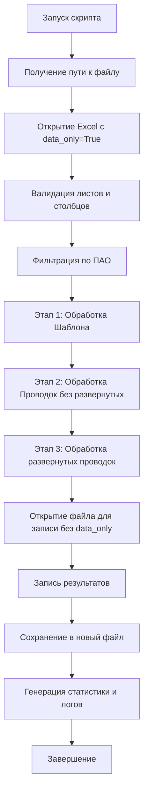

# План реализации скрипта мэппинга проводок

## Цель
Создать Python-скрипт для автоматического мэппинга данных между двумя листами Excel-файла с сохранением формул и генерацией подробной статистики.

## Технический стек
- **openpyxl**: для работы с Excel-файлами с сохранением формул
- **pandas**: для эффективной обработки табличных данных
- **sys**: для работы с аргументами командной строки
- **datetime**: для временных меток в логах
- **re**: для валидации данных

## Структура данных

### Лист "Шаблон пров и атриб"
- Заголовки: строка 7
- Данные: строки 8-3100
- Ключевые столбцы:
  - "Признак плана счетов (ПАО/КИБ)" - фильтр по "ПАО"
  - "Номер счета по Дт" - компонент ключа
  - "Символ ОФР Дт" - компонент ключа
  - "Номер счета по Кт" - компонент ключа
  - "Символ ОФР Кт" - компонент ключа
  - "№ Показа" - источник для "СП Робот"
  - "Дт Мэпинг Робот" - целевой столбец (запись ссылок)
  - "Кт Мэпинг Робот" - целевой столбец (запись ссылок)

### Лист "Проводки по СП анализ"
- Заголовки: строка 1
- Данные: строки 2-40000
- Ключевые столбцы:
  - "Дт" - формат: счет_символОФР (например, 70606_3141302)
  - "Кт" - формат: счет_символОФР
  - "Номера строк развёрнутых проводок" - индикатор второго этапа обработки
  - "Дт Мэпинг Робот" - целевой столбец
  - "Кт Мэпинг Робот" - целевой столбец
  - "СП Робот" - целевой столбец

## Архитектура решения



## Детальное описание этапов

### 1. Инициализация и валидация

**Функция: `get_input_file()`**
```python
if len(sys.argv) > 1:
    input_file = sys.argv[1]
else:
    input_file = input("Введите путь к Excel-файлу: ").strip()
if not input_file:
    raise ValueError("Ошибка: путь не указан.")
```

**Функция: `validate_file_structure(workbook)`**
- Проверить наличие листов: "Шаблон пров и атриб", "Проводки по СП анализ"
- Проверить наличие всех требуемых столбцов на каждом листе
- В случае отсутствия - выдать ошибку и остановиться

### 2. Нормализация и валидация данных

**Функция: `normalize_template_value(value, row_num, column_name, logger)`**
- Входные данные: значение ячейки, номер строки, имя столбца, объект логгера
- Обработка:
  1. Проверить на None/пустое значение
  2. Преобразовать в строку
  3. Удалить все точки из значения
  4. Проверить, что остались только цифры
  5. Если есть недопустимые символы - записать в лог и вернуть None
- Возврат: нормализованное значение или None

**Функция: `parse_provodki_account(value, row_num, column_name, logger)`**
- Входные данные: значение вида "70606_3141302" или "70606"
- Обработка:
  1. Проверить на None/пустое значение
  2. Преобразовать в строку
  3. Подсчитать количество подчеркиваний
  4. Если больше 1 - невалидно, записать в лог, вернуть None
  5. Если 1 подчеркивание - разделить на счет и символ ОФР
  6. Если 0 подчеркиваний - счет есть, символ ОФР пустой
  7. Удалить точки из обеих частей
  8. Проверить, что в каждой части только цифры (или пусто для ОФР)
  9. Если есть недопустимые символы - записать в лог, вернуть None
- Возврат: (счет_normalized, ofr_normalized) или None

### 3. Формирование ключей сравнения

**Функция: `create_comparison_key(dt_account, dt_ofr, kt_account, kt_ofr)`**
- Формат ключа: `f"{dt_account}{dt_ofr}{kt_account}{kt_ofr}"`
- Пустые значения ОФР допустимы (будут пустыми строками в ключе)
- Возврат: строка-ключ

### 4. Этап 1: Мэппинг Шаблон → Проводки

**Алгоритм:**
1. Прочитать лист "Шаблон пров и атриб" (строки 8+)
2. Отфильтровать строки по "Признак плана счетов (ПАО/КИБ)" == "ПАО"
3. Для каждой строки:
   - Нормализовать значения 4 столбцов (Номер счета по Дт, Символ ОФР Дт, Номер счета по Кт, Символ ОФР Кт)
   - Если нормализация не удалась хотя бы для одного счета - пропустить строку, записать в лог
   - Создать ключ сравнения
   - Сохранить в словарь: `template_keys[comparison_key] = [список номеров строк Excel]`

4. Прочитать лист "Проводки по СП анализ" (строки 2+)
5. Отфильтровать строки, где "Номера строк развёрнутых проводок" пусто
6. Для каждой строки:
   - Парсить "Дт" и "Кт" (разделить по подчеркиванию, нормализовать)
   - Если парсинг не удался - пропустить, записать в лог
   - Создать ключ сравнения
   - Сохранить в словарь: `provodki_keys[comparison_key] = [список объектов {row, dt_col, kt_col}]`

7. Для каждого ключа из `template_keys`:
   - Если ключ есть в `provodki_keys`:
     - Для каждой строки шаблона с этим ключом:
       - Собрать все ссылки на ячейки "Дт" из проводок: `='Проводки по СП анализ'!B10, ='Проводки по СП анализ'!B15`
       - Записать в "Дт Мэпинг Робот" (строка шаблона)
       - Собрать все ссылки на ячейки "Кт" из проводок
       - Записать в "Кт Мэпинг Робот" (строка шаблона)
     - Увеличить счетчик успешных совпадений

### 5. Этап 2: Мэппинг Проводки → Шаблон (без развёрнутых)

**Алгоритм:**
1. Для каждого ключа из `provodki_keys`:
   - Если ключ есть в `template_keys`:
     - Для каждой строки проводок с этим ключом:
       - Собрать все ссылки на ячейки "Номер счета по Дт" из шаблона: `='Шаблон пров и атриб'!A10, ='Шаблон пров и атриб'!A15`
       - Записать в "Дт Мэпинг Робот" (строка проводок)
       - Собрать все ссылки на ячейки "Номер счета по Кт" из шаблона
       - Записать в "Кт Мэпинг Робот" (строка проводок)
       - Собрать уникальные значения "№ Показа" из соответствующих строк шаблона
       - Записать через запятую в "СП Робот" (строка проводок)
     - Увеличить счетчик успешных совпадений

### 6. Этап 3: Обработка развёрнутых проводок

**Алгоритм:**
1. Вернуться к началу листа "Проводки по СП анализ"
2. Для каждой строки, где "Номера строк развёрнутых проводок" не пусто:
   - Парсить значение столбца (например, "5, 10, 23")
   - Разделить по запятой и пробелу, получить список номеров строк Excel
   - Для каждого номера строки:
     - Прочитать значения из столбцов "Дт Мэпинг Робот" и "Кт Мэпинг Робот" этой строки
     - Добавить в список ссылок для текущей строки
   - Объединить все собранные ссылки через запятую с пробелом
   - Записать в "Дт Мэпинг Робот" текущей строки (формат: `='Проводки по СП анализ'!T3180, ='Проводки по СП анализ'!T3181`)
   - Записать в "Кт Мэпинг Робот" текущей строки
   - Увеличить счетчик обработанных развёрнутых проводок

### 7. Формирование ссылок Excel

**Функция: `create_excel_reference(sheet_name, column_letter, row_number)`**
```python
return f"='{sheet_name}'!{column_letter}{row_number}"
```

**Функция: `join_references(references_list)`**
```python
return ", ".join(references_list)
```

### 8. Сохранение результатов

**Алгоритм:**
1. Закрыть workbook с `data_only=True`
2. Открыть файл заново с `data_only=False` для сохранения формул
3. Для каждой записи, которую нужно сделать:
   - Найти ячейку по координатам
   - Записать формулу как строку (начинается с `=`)
4. Сохранить в новый файл: `{original_name}_processed.xlsx`

### 9. Логирование и статистика

**Лог-файл (errors.txt):**
```
[2026-04-09 23:05:38] ОШИБКА | Лист: Шаблон пров и атриб | Строка: 125 | Столбец: Номер счета по Дт | Значение: 70606.ABC | Причина: Недопустимые символы (только цифры и точки)
[2026-04-09 23:05:38] ПРЕДУПРЕЖДЕНИЕ | Лист: Проводки по СП анализ | Строка: 3567 | Столбец: Дт | Значение: 70606_314_1302 | Причина: Более одного подчеркивания
```

**Статистика (statistics.txt):**
```
=== СТАТИСТИКА ОБРАБОТКИ ===
Дата и время: 2026-04-09 23:05:38

Лист "Шаблон пров и атриб":
  Всего строк: 3100
  Обработано строк (после фильтра ПАО): 1072
  Пропущено (ошибки валидации): 15
  Успешно сматчено с Проводками: 126

Лист "Проводки по СП анализ":
  Всего строк: 40000
  Обработано строк (без развёрнутых): 3408
  Обработано развёрнутых проводок: 452
  Пропущено (ошибки валидации): 23
  Успешно сматчено с Шаблоном: 45

Общее количество ошибок: 38
Общее количество предупреждений: 12

Результат сохранён в: Book1_processed.xlsx
```

## Структура кода

```python
# Импорты
import sys
import openpyxl
import pandas as pd
from datetime import datetime
from collections import defaultdict
import re

# Класс для логирования
class ProcessLogger:
    def __init__(self, log_file):
        self.log_file = log_file
        self.errors = []
        self.warnings = []
    
    def log_error(self, sheet, row, column, value, reason):
        # Запись ошибки
        pass
    
    def log_warning(self, sheet, row, column, value, reason):
        # Запись предупреждения
        pass
    
    def save(self):
        # Сохранение логов в файл
        pass

# Класс для статистики
class ProcessStatistics:
    def __init__(self):
        self.template_total = 0
        self.template_processed = 0
        self.template_errors = 0
        self.template_matched = 0
        # ... другие счетчики
    
    def save(self, filename):
        # Сохранение статистики в файл
        pass

# Функции валидации
def normalize_template_value(value, row_num, column_name, logger):
    pass

def parse_provodki_account(value, row_num, column_name, logger):
    pass

def create_comparison_key(dt_account, dt_ofr, kt_account, kt_ofr):
    pass

# Функции работы с Excel
def get_column_letter_by_name(ws, column_name, header_row):
    pass

def create_excel_reference(sheet_name, column_letter, row_number):
    pass

# Основные функции обработки
def process_template_sheet(wb_read, logger, stats):
    # Этап 1
    pass

def process_provodki_sheet(wb_read, template_keys, logger, stats):
    # Этап 2
    pass

def process_expanded_provodki(wb_read, logger, stats):
    # Этап 3
    pass

def write_results_to_excel(input_file, results_data):
    # Запись результатов
    pass

# Главная функция
def main():
    try:
        # 1. Получение пути к файлу
        input_file = get_input_file()
        
        # 2. Инициализация логгера и статистики
        logger = ProcessLogger("errors.txt")
        stats = ProcessStatistics()
        
        # 3. Открытие файла для чтения значений
        wb_read = openpyxl.load_workbook(input_file, data_only=True)
        
        # 4. Валидация структуры
        validate_file_structure(wb_read)
        
        # 5. Обработка Шаблона (Этап 1)
        template_keys = process_template_sheet(wb_read, logger, stats)
        
        # 6. Обработка Проводок (Этап 2)
        results = process_provodki_sheet(wb_read, template_keys, logger, stats)
        
        # 7. Обработка развёрнутых проводок (Этап 3)
        results_expanded = process_expanded_provodki(wb_read, logger, stats)
        
        wb_read.close()
        
        # 8. Запись результатов
        output_file = write_results_to_excel(input_file, results + results_expanded)
        
        # 9. Сохранение логов и статистики
        logger.save()
        stats.save("statistics.txt")
        
        print(f"Обработка завершена успешно!")
        print(f"Результат сохранён в: {output_file}")
        print(f"Логи ошибок: errors.txt")
        print(f"Статистика: statistics.txt")
        
    except Exception as e:
        print(f"КРИТИЧЕСКАЯ ОШИБКА: {e}")
        return 1
    
    return 0

if __name__ == "__main__":
    sys.exit(main())
```

## Особенности реализации

### 1. Работа с формулами
- Использовать два экземпляра workbook:
  - `data_only=True` для чтения вычисленных значений
  - `data_only=False` для записи с сохранением формул

### 2. Обработка больших объёмов данных
- Использовать pandas DataFrame для фильтрации данных по "ПАО"
- Словари для быстрого поиска по ключам
- Батчинг при записи результатов (если необходимо)

### 3. Валидация данных
- Строгая проверка на наличие только цифр и точек (для Шаблона)
- Проверка на единственность подчеркивания (для Проводок)
- Логирование каждой невалидной строки с детальной информацией

### 4. Формат ссылок
- Все ссылки начинаются с `=`
- Название листа в одинарных кавычках, если содержит пробелы
- Несколько ссылок разделяются запятой и пробелом: `", "`

### 5. Обработка пустых значений
- Пустые значения для символов ОФР допустимы
- Пустые значения для счетов Дт/Кт недопустимы (невалидная строка)

## Тестирование

1. **Тест на корректность нормализации:**
   - "70.606" → "70606"
   - "70606_314.13.02" → ("70606", "3141302")
   - "70606.ABC" → None (ошибка)

2. **Тест на формирование ключей:**
   - dt="70606", dt_ofr="3141302", kt="47423", kt_ofr="" → "706063141302474230"

3. **Тест на формирование ссылок:**
   - sheet="Проводки по СП анализ", col="B", row=10 → "='Проводки по СП анализ'!B10"

4. **Тест на объединение ссылок:**
   - [ref1, ref2, ref3] → "ref1, ref2, ref3"

5. **Интеграционный тест:**
   - Запустить на тестовом файле с известными данными
   - Проверить корректность результатов вручную

## Возможные проблемы и решения

| Проблема | Решение |
|----------|---------|
| Формулы не сохраняются | Использовать два workbook: один для чтения (data_only=True), второй для записи |
| Медленная обработка больших файлов | Использовать pandas для фильтрации, словари для поиска |
| Ошибки при парсинге значений | Обёрнуть в try-except, логировать все ошибки |
| Неправильный формат ссылок | Создать отдельную функцию с тестами |
| Неожиданные символы в данных | Использовать regex для валидации |

## Следующие шаги

1. Создать базовую структуру файла с импортами
2. Реализовать классы логгера и статистики
3. Реализовать функции валидации и нормализации
4. Реализовать функции обработки каждого этапа
5. Реализовать функцию записи результатов
6. Добавить обработку ошибок
7. Протестировать на тестовых данных
8. Оптимизировать производительность (если необходимо)
